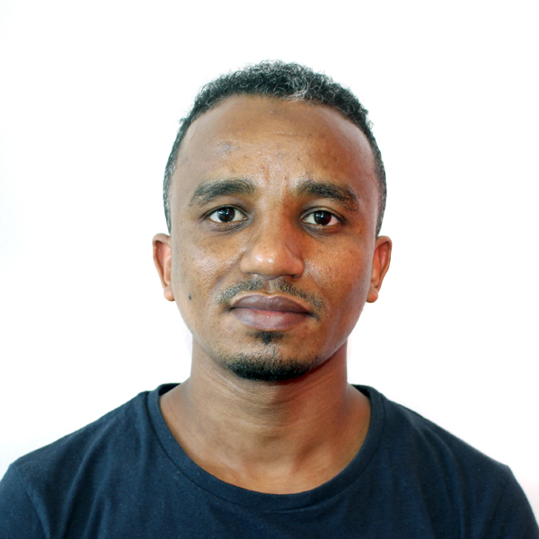

## DSI-Africa Machine Learning Short Course: UKZN Hub

### Lectures

* Lectures will be from **Monday, 23 January 2023 – Friday, 3rd February 2023**
* We will be using **R** for all programming assignments and projects. 

### Instructor

<table class="tg">
<thead>
  <tr>
    <th class="tg-amwm">Role</th>
    <th class="tg-amwm">Name</th>
    <th class="tg-amwm">Email</th>
    <th class="tg-amwm">Brief Bio</th>
    <th class="tg-amwm"></th>
  </tr>
</thead>
<tbody>
  <tr>
    <td class="tg-0lax">Course Oversight</td>
    <td class="tg-0lax">Prof. Henry Mwambi, co-PI UKZN</td>
    <td class="tg-0lax"><a href="mailto:mwambih@ukzn.ac.za">mwambih@ukzn.ac.za</a>. </td>
    <td class="tg-0lax">Professor at the University of KwaZulu-Natal. Leads research on applied statistics, biostatistics and infectious disease modelling at the individual and population level.  Prof Mwambi’s main areas of research areas are in applied statistics, biostatistics and infectious disease modelling at the individual and population level.  At the University of KwaZulu-Natal, he has taught theory and applied courses, among them a Biostatistics course covering key areas in biostatistics, namely general epidemiology principles, cohort studies, case-control studies, survival analysis and clinical trials.  He is currently working with and has supervised a number of PhD and Masters students on various topics in biostatistics and epidemiology such as the analysis of non-Gaussian longitudinal and clustered disease outcome data, survival analysis, modelling recurrent events, longitudinal data analysis including missing data, and infectious disease modelling.  Some of the students he has supervised hold senior positions as Biostatisticians and academics in leading medical and bioinformatics research institutes and centres and universities within South Africa, sub-Saharan Africa and abroad.  He has authored and co-authored over 100 journal articles in reputable peer-reviewed international journals.    He is keen and passionate to develop and help enhance biostatistics and data science capacity in the Sub-Saharan Africa region and Africa at large.  He is currently a Co-PI of a number of landmark projects among them the Sub-Saharan Africa Consortium for Advanced Biostatistics (SSACAB) Training Programme whose aim is to enhance capacity in Biostatistics through MSc, PhD and Postdoctoral training by involving both academic and research institutions to provide supervision and mentorship of fellows </td>
    <td class="tg-0lax"></td>
  </tr>
  <tr>
    <td class="tg-0lax">Course Oversight</td>
    <td class="tg-0lax">Prof. Till Bärnighausen, co-PI, Heidelberg Institute of Global Health</td>
    <td class="tg-0lax"><a href="mailto:till.baernighausen@uni-heidelberg.de">till.baernighausen@uni-heidelberg.de</a>. </td>
    <td class="tg-0lax">Till Bärnighausen is Alexander von Humboldt Professor and Director of the Heidelberg Institute of Global Health (HIGH), Faculty of Medicine and University Hospital, University of Heidelberg, Germany. He is also Senior Faculty at the Wellcome Trust’s Africa Health Research Institute (AHRI) in South Africa and a fellow at the Harvard Center for Population and Development Studies. Till’s research focuses on establishing the causal impact of global health interventions on population health, social and economic outcomes. In particular, he works on large-scale population health interventions for HIV, diabetes, hypertension, and vaccine-preventable diseases. Till uses design research to develop interventions and randomized controlled experiments and quasi-experiments to establish intervention impacts. He has developed several new methods for applied population health research.</td>
    <td class="tg-0lax"></td>
  </tr>
  <tr>
    <td class="tg-0lax">Course Oversight</td>
    <td class="tg-0lax">Prof. Heather Mattie, Training Director, Harvard School of Public Health</td>
    <td class="tg-0lax"><a href="mailto:hemattie@hsph.harvard.edu">hemattie@hsph.harvard.edu</a>. </td>
    <td class="tg-0lax">Dr. Heather Mattie is a Lecturer on Biostatistics and Co-Director of the Health Data Science master’s program in the Department of Biostatistics at the Harvard T.H. Chan School of Public Health.  Dr. Mattie’s research focuses on the intersection between biostatistics, data science, and network science. She has developed methods that predict tie strength in a network, which assists in modeling the spread of disease and information. Additionally, her work has examined the potential for artificial intelligence to improve inference from data for care and population health, as well as the challenges related to bias and scalability in such models. Dr. Mattie is also involved in the diversity, equity, and inclusion efforts of the Biostatistics department and enjoys mentoring students.</td>
    <td class="tg-0lax"></td>
  </tr>
  <tr>
    <td class="tg-0lax">Course Oversight</td>
    <td class="tg-0lax">Prof. Saloshni Naidoo, Training Director, UKZN</td>
    <td class="tg-0lax"><a href="mailto:Naidoos71@ukzn.ac.za">Naidoos71@ukzn.ac.za</a>. </td>
    <td class="tg-0lax">Professor Naidoo obtained her medical degree from the University of Natal in 1992, became a Public Health Medicine Specialist in 2003 and an Associate in the Division of Occupational Medicine in the College of Public Health Medicine in 2010. In 2006 she obtained a Master of Medicine Degree in Community Health from the University of KwaZulu-Natal and in 2011 her PhD from the Institute of Risk Assessment Science, Utrecht University, Netherlands. Her academic career spans 17 years, initially as a lecturer in the Discipline of Occupational and Environmental Health, the University of KwaZulu-Natal in 2003 and now as the Head of the Department of Public Health Medicine in the School of Nursing and Public Health in the College of Health Sciences, University of KwaZulu-Natal; a post which she has held since 2015.  She is a C2 rated researcher in terms of the National Research Foundation’s rating standard.  Her research interests are in “TB in Healthcare workers and the risk of their work environments” and “Environmental impacts on women and child health”. Amongst the multiple studies in which she is involved, she currently leads a cohort project studying the impact of prenatal pesticide exposure on maternal reproductive health and infant neurodevelopment in KwaZulu-Natal South Africa. Her multiple publications highlight the plight of women working in small-scale agriculture and the risks faced by healthcare workers in the public health sector in South Africa.</td>
    <td class="tg-0lax"></td>
  </tr>
  <tr>
    <td class="tg-0lax">Facilitator</td>
    <td class="tg-0lax">Dr Sandra Barteit</td>
    <td class="tg-0lax"><a href="mailto:barteit@uni-heidelberg.de">barteit@uni-heidelberg.de</a>. </td>
    <td class="tg-0lax">My enthusiasm for Global Health led me to join the Heidelberg University Institute of Global Health as a full-time researcher in 2015. Currently, amongst many other projects, I am leading a project that implements novel measurements of wearables in vulnerable populations in Kenya and Burkina Faso to conduct cutting-edge climate change and health research, which helpd us gain new insights into the disease burden in poor populations facing exposure to climate change, such as heat or droughts. Furthermore, I lead the Blended Learning in Zambia (BLiZ) project that implements blended learning to strengthen medical education at the largest medical University in Zambia. In my research, I apply a variety of analytics models and cross-cutting analytics modeling concepts and cases.</td>
    <td class="tg-0lax"></td>
  </tr>
  <tr>
    <td class="tg-0lax">Facilitator</td>
    <td class="tg-0lax">Prof. Serestina Viriri, Dean in the School of Maths, Statistics and Computer Science</td>
    <td class="tg-0lax"><a href="mailto:Viriris@ukzn.ac.za">Viriris@ukzn.ac.za</a>. </td>
    <td class="tg-0lax">Serestina Viriri is a full professor of Computer Science in the School of Mathematics, Statistics and Computer Science at the University of KwaZulu-Natal in South Africa. He is the former HoD of Computer Science discipline. Prof Viriri has been in academia since 1998. His main research areas include Artificial Intelligence, Computer Vision, Machine Learning, Medical Image Analysis, Pattern Recognition, and other Image Processing related fields, such as biometrics. He has published extensively in several Artificial Intelligence and Computer Vision-related accredited journals and international and national conference proceedings. Prof. Viriri serves as a reviewer for several Machine Learning and Computer Vision-related journals. He has also served on program committees for numerous international and national conferences. He has supervised to completion several Ph.D. and M.Sc. candidates. Prof Viriri is a rated researcher by National Research Foundation (NRF) of South Africa. Prof Viriri holds B.Sc. (Mathematics &amp; Computer Science), M.Sc. (Computer Science), and Ph.D. (Computer Science).</td>
    <td class="tg-0lax"></td>
  </tr>
  <tr>
    <td class="tg-0lax">Facilitator</td>
    <td class="tg-0lax">Dr. Palwasha Khan, Head of informatics at AHRI</td>
    <td class="tg-0lax"></td>
    <td class="tg-0lax">Palwasha Khan is a Clinical Associate Professor in Infectious Disease Epidemiology at London School of Hygiene &amp; Tropical Medicine and a clinical epidemiologist with Interactive Research &amp; Development primarily working at the clinical academia-implementation interface. She is currently seconded to the Africa Health Research Institute (AHRI) in Kwa-Zulu Natal as head of the Health Informatics section of the AHRI Data Science Unit.  Her research interests include combining field epidemiological studies and programmatic electronic health data to further understanding of Mycobacterium tuberculosis transmission at a population-level.</td>
    <td class="tg-0lax"></td>
  </tr>
  <tr>
    <td class="tg-0lax">Facilitator</td>
    <td class="tg-0lax">Dr. Mandlenkosi Gwetu</td>
    <td class="tg-0lax"><a href="mailto:Gwetum@ukzn.ac.za">Gwetum@ukzn.ac.za</a>. </td>
    <td class="tg-0lax">Mandla Gwetu is a Computer Scientist with over 10 years of academic experience. He is also an alumnus of the Heidelberg Laureate Forum and holds a Doctoral Degree in Computer Science. He currently serves as the Academic Leader for Computer Science at UKZN. His research focus lies mainly in the computational aspects of computer vision and machine learning. He currently supervises several PhD &amp; MSc students in these areas. Mandla holds industry certifications in Java and AWS. He is an experienced reviewer of several Computer Science Journal and international conferences.</td>
    <td class="tg-0lax"></td>
  </tr>
  <tr>
    <td class="tg-0lax">Facilitator</td>
    <td class="tg-0lax">Mr. Asad Jeewa, Lecturer, School of Mathematics, Statistics and Computer Science, UKZN</td>
    <td class="tg-0lax"><a href="mailto:jeewaa1@ukzn.ac.za">jeewaa1@ukzn.ac.za</a>. </td>
    <td class="tg-0lax">Asad Jeewa is a lecturer of Computer Science in the School of Mathematics, Statistics and Computer Science at the University of KwaZulu-Natal. He previously served as a researcher at Instadeep (in Multi-Agent Reinforcement Learning) and IBM Research Labs (in Natural Langugage Processing). He is currently pursuing a PhD at UKZN in Social Reiforcement Learning. Asad holds industry certifications in Software Development and Deep Learning. He supervises MSc and Honours students and reviews for international conferences.</td>
    <td class="tg-0lax"></td>
  </tr>
  <tr>
    <td class="tg-0lax">Facilitator</td>
    <td class="tg-0lax">Yuvika Singh, Lecturer Dean in the School of Maths, Statistics and Computer Science</td>
    <td class="tg-0lax"><a href="mailto:SinghY1@ukzn.ac.za">SinghY1@ukzn.ac.za</a>. </td>
    <td class="tg-0lax">Yuvika Singh is a Computer Science lecturer and a PhD candidate at the University of KwaZulu-Natal. Yuvika’s research area is in machine learning, with particular focus on deep learning in medical imagining. Yuvika is also a part of the Centre for Artificial Intelligence Research (CAIR), as well as the KwaZulu-Natal centre for Radio astronomy Economic Advancement, Technology and Entrepreneurship (KREATE) where she acts in the capacity of a computational data scientist. Yuvika had also served as a reviewer for Machine Learning conferences.</td>
    <td class="tg-0lax"></td>
  </tr>
  <tr>
    <td class="tg-0lax">Teaching Assistant</td>
    <td class="tg-0lax">Dr. Gabriel Kallah-Dagadu,m DSI postdoc</td>
    <td class="tg-0lax"><a href="mailto:kallahdagadug@ukzn.ac.za">kallahdagadug@ukzn.ac.za</a>. </td>
    <td class="tg-0lax">Gabriel Kallah-Dagadu holds a Ph.D. in Statistics from the University of Cape Coast, Ghana. Gabriel is Lecturer at the University of Ghana and has eight years of teaching and supervising experience in Statistics, Probability, and Data Science. He is currently a postdoctoral fellow in the DSI-Africa Training program on Health Data Science project hosted by the University of KwaZulu-Natal, South Africa, Harvard T. H. Chan School of Public Health, USA, and Heidelberg Institute of Global Health, Germany. His research interest are centered on applied probability, computational statistics, and machine learning with real-life applications to health, climate change, and finance. He has published scientific and peer-reviewed articles in local and international journals.</td>
    <td class="tg-0lax"></td>
  </tr>
  <tr>
    <td class="tg-0lax">Teaching Assistant</td>
    <td class="tg-0lax">Dr. Mohanad Mohammed, DSI postdoc</td>
    <td class="tg-0lax"><a href="mailto:mohammedm1@ukzn.ac.za">mohammedm1@ukzn.ac.za</a>. </td>
    <td class="tg-0lax">Mohanad Mohammed earned his PhD from the School of Mathematics, Statistics, and Computer Science (SMSCS), specializing in Statistics at the University of KwaZulu-Natal (UKZN) in 2022. During his MSc and PhD studies, he worked as a tutor and an Adhoc lecturer in SMSCS at the same university, which continued from 2019 to 2022. He is currently a post-doc fellow working on a health data science project hosted by UKZN in collaboration with Harvard T. H. Chan, School of Public Health, USA, and Heidelberg University and Germany. His research has focused on developing and applying statistical methods in genomics, genetics, public health, and the environment. He is interested in contributing to a deeper understanding of cancer disease modeling using gene expression data to facilitate decision-making concerning diagnosis, treatment, and care. In addition, Mohammed has authored and co-authored many articles, ten of which have been published in reputable journals and conference papers. He has attended and presented at various international and local workshops and conferences and is an active member of the biostatistics team under the MASAMU program.</td>
    <td class="tg-0lax"></td>
  </tr>
</tbody>
</table>

### Schedule

Note: all lectures will be held *in-person* AND *online* via Zoom links. For online attendants please use the following link: [ZOOM LINK](https://tinyurl.com/2yxd7pwk)

#### Week 1:

<table class="tg">
<thead>
  <tr>
    <th class="tg-amwm">Time</th>
    <th class="tg-amwm">Monday 23/01</th>
    <th class="tg-amwm">Tuesday 24/01</th>
    <th class="tg-amwm">Wednesday 25/01</th>
    <th class="tg-amwm">Thursday 26/01</th>
    <th class="tg-amwm">Friday 27/01</th>
  </tr>
</thead>
<tbody>
  <tr>
    <td class="tg-amwm">9:00-10:30 am</td>
    <td class="tg-0lax">Introduction to machine learning</td>
    <td class="tg-0lax">Naïve Bayes, KNN</td>
    <td class="tg-0lax">Regression and classification trees</td>
    <td class="tg-0lax">Regularization, Ridge Regression, LASSO</td>
    <td class="tg-0lax">Dealing with a multiclass classification problem</td>
  </tr>
  <tr>
    <td class="tg-amwm">10:30-10:45 am</td>
    <td class="tg-0lax">Break</td>
    <td class="tg-0lax">Break</td>
    <td class="tg-0lax">Break</td>
    <td class="tg-0lax">Break</td>
    <td class="tg-0lax">Break</td>
  </tr>
  <tr>
    <td class="tg-amwm">10:45-12:00 pm</td>
    <td class="tg-0lax">Logistic regression</td>
    <td class="tg-0lax">LDA and QDA</td>
    <td class="tg-0lax">Random forests and boosting</td>
    <td class="tg-0lax">Support vector machines</td>
    <td class="tg-0lax">Multinomial regression</td>
  </tr>
  <tr>
    <td class="tg-amwm">12:00-1:00 pm</td>
    <td class="tg-0lax">Lunch</td>
    <td class="tg-0lax">Lunch</td>
    <td class="tg-0lax">Lunch</td>
    <td class="tg-0lax">Lunch</td>
    <td class="tg-0lax">Lunch</td>
  </tr>
  <tr>
    <td class="tg-amwm">1:00-2:15 pm</td>
    <td class="tg-0lax">Performance metrics, ROC, AUROC</td>
    <td class="tg-0lax">Tuning of parameters, avoid over fitting</td>
    <td class="tg-0lax">Feature selection and feature importance</td>
    <td class="tg-0lax">Tuning of machines, comparison of machines</td>
    <td class="tg-0lax">The validation of machines problem</td>
  </tr>
  <tr>
    <td class="tg-amwm">2:15-2:30 pm</td>
    <td class="tg-0lax">Break</td>
    <td class="tg-0lax">Break</td>
    <td class="tg-0lax">Break</td>
    <td class="tg-0lax">Break</td>
    <td class="tg-0lax">Break</td>
  </tr>
  <tr>
    <td class="tg-amwm">2:30-3:45 pm</td>
    <td class="tg-0lax">Lab</td>
    <td class="tg-0lax">Lab</td>
    <td class="tg-0lax">Lab</td>
    <td class="tg-0lax">Lab</td>
    <td class="tg-0lax">Lab</td>
  </tr>
</tbody>
</table>

#### Week 2:

<table class="tg">
<thead>
  <tr>
    <th class="tg-amwm">Time</th>
    <th class="tg-amwm">Monday 30/01</th>
    <th class="tg-amwm">Tuesday 31/01</th>
    <th class="tg-amwm">Wednesday 01/02</th>
    <th class="tg-amwm">Thursday 02/02</th>
    <th class="tg-amwm">Friday 03/02</th>
  </tr>
</thead>
<tbody>
  <tr>
    <td class="tg-amwm">9:00-10:30 am</td>
    <td class="tg-0lax">Introduction to Cross Validation; Types of Cross Validation</td>
    <td class="tg-0lax">Application: Individual Data inspection and Preparation for modelling</td>
    <td class="tg-0lax">Application: kNN, LDA and QDA</td>
    <td class="tg-0lax">Application: Random forests: Regression and classification trees</td>
    <td class="tg-0lax">Report writing based on the cases (Dataset) the participant(s) work on</td>
  </tr>
  <tr>
    <td class="tg-amwm">10:30-10:45 am</td>
    <td class="tg-0lax">Break</td>
    <td class="tg-0lax">Break</td>
    <td class="tg-0lax">Break</td>
    <td class="tg-0lax">Break</td>
    <td class="tg-0lax">Break</td>
  </tr>
  <tr>
    <td class="tg-amwm">10:45-12:00 pm</td>
    <td class="tg-0lax">Practical Dataset partitioning</td>
    <td class="tg-0lax">Application: Logistic Regression Model</td>
    <td class="tg-0lax">Application: kNN, LDA and QDA</td>
    <td class="tg-0lax">Interpretation of the random forest results using variable importance</td>
    <td class="tg-0lax">Report writing based on the cases (Dataset) the participant</td>
  </tr>
  <tr>
    <td class="tg-amwm">12:00-1:00 pm</td>
    <td class="tg-0lax">Lunch</td>
    <td class="tg-0lax">Lunch</td>
    <td class="tg-0lax">Lunch</td>
    <td class="tg-0lax">Lunch</td>
    <td class="tg-0lax">Lunch</td>
  </tr>
  <tr> 
    <td class="tg-amwm">1:00-2:15 pm</td>
    <td class="tg-0lax">Dealing with imbalanced datasets</td>
    <td class="tg-0lax">Application: Naïve Bayes model</td>
    <td class="tg-0lax">Application: Evaluation of the models’ performance and Interpretations</td>
    <td class="tg-0lax">Application: Ridge Regression, LASSO</td>
    <td class="tg-0lax">Report writing based on the cases (Dataset) the participant</td>
  </tr>
  <tr>
    <td class="tg-amwm">2:15-2:30 pm</td>
    <td class="tg-0lax">Break</td>
    <td class="tg-0lax">Break</td>
    <td class="tg-0lax">Break</td>
    <td class="tg-0lax">Break</td>
    <td class="tg-0lax">Break</td>
  </tr>
  <tr> 
    <td class="tg-amwm">2:30-3:45 pm</td>
    <td class="tg-0lax">Practical evaluation of model performance through cross validation</td>
    <td class="tg-0lax">Interpretations of the models results and performance evaluation</td>
    <td class="tg-0lax">Application: Evaluation of the models’ performance and Interpretations</td>
    <td class="tg-0lax">Application: Evaluation of the models’ performance and Interpretations</td>
    <td class="tg-0lax">Course Evaluation and Closing Remarks</td>
  </tr>
</tbody>
</table>

